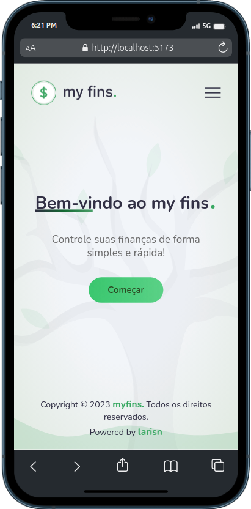

<h1 align="center">

</h1>
 

<h3 align="center">
💸 Preview - Desktop
</h3>

 
 

<h3 align="center">
💸 Preview - Mobile e Tablet
</h3>
 

&ensp; &ensp; &ensp; &ensp; &ensp; &ensp; &ensp; &ensp; &ensp; &ensp; &ensp; &ensp; &ensp; &ensp; &ensp;  &ensp; &ensp; &ensp; 
 
 

## 💲 Sobre

> Trata-se de um site que possui as ferramentas necessárias para gerenciar suas despesas de forma fácil e eficiente. Foi desenvolvido com ReactJS e também com o JSON Server, que é uma biblioteca que permite a criação de uma API REST simulada utilizando um arquivo JSON como uma fonte de dados, ou seja, um "fake backend".  
O projeto conta com algumas funcionalidades, como menu hambúrguer, fazer o CRUD (Criação, Edição, Atualização e Exclusão) das suas despesas e também está 100% responsivo.  
Também utilizei algumas outras tecnologias como: Sass, React Reveal,  uuidv4 e todo design foi desenvolvido no Figma.
 

## 💵 Seções
O site possui cinco partes:

- **Home:** É a página principal do site.
- **Criar lista:** É uma página com formulários para a criação da despesa.
- **Despesas:** É a página que informa e apresenta os detalhes das despesas.
- **Edição de despesas:** Página para a edição das despesas.
- **Adição de prioridades:** Se localiza na mesma página de edição, apresenta uma seção de adição de   prioridades dentro de cada despesa e também mostra os detalhes das mesmas.
 

---

## 💰 Tecnologias utilizadas:

Para o desenvolvimento deste site utilizei as seguintes tecnologias:

* React
* JavaScript
* JSON Server
* Sass
* Figma

---

## 🎐 Licença
Esse projeto está sob licença. Clique no arquivo [LICENÇA](https://github.com/larisn/larisn/blob/main/LICENSE.md) para ver mais detalhes.

 

---

Feito com 💚 by larisn

